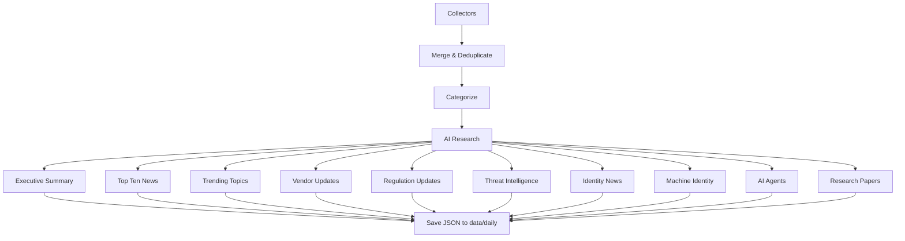

# Daily Intelligence Workflow

```mermaid
flowchart TD
    A[Collectors] --> B[Merge & Deduplicate]
    B --> C[Categorize]
    C --> D[AI Research]
    D --> E[Executive Summary]
    D --> F[Top Ten News]
    D --> G[Trending Topics]
    D --> H[Vendor Updates]
    D --> I[Regulation Updates]
    D --> J[Threat Intelligence]
    D --> K[Identity News]
    D --> L[Machine Identity]
    D --> M[AI Agents]
    D --> N[Research Papers]
    E --> O[Save JSON to data/daily]
    F --> O
    G --> O
    H --> O
    I --> O
    J --> O
    K --> O
    L --> O
    M --> O
    N --> O
```
